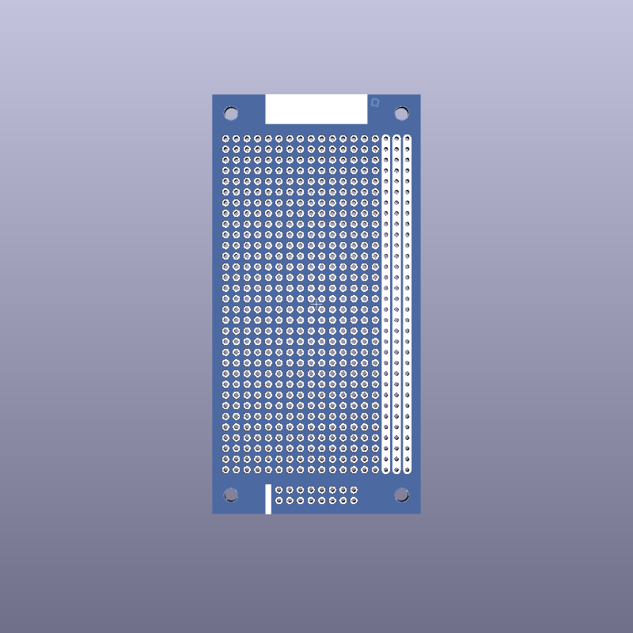
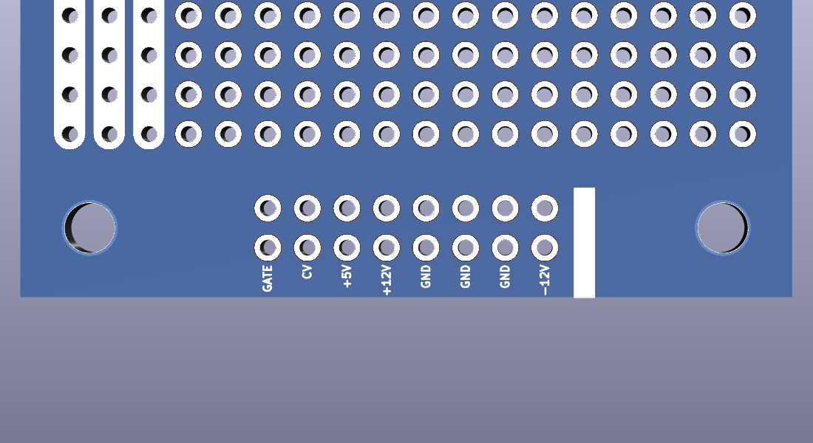

# Basic Eurorack Protoboard

This is a quite minimal 3U board for modular synth prototyping. It uses the standard grid spacing of 2.54 mm (100 mils). The only copper traces on this PCB connect the through-hole pads on each of the three freely usable rails. Between the bottom mounting holes a provision for a pin or box header for 16-position IDC connectors is made.

On the back (solder side) the header pins are labelled to mitigate confusion.

Dimensions: 49.53 x 99.7 mm

Mounting hole pattern: 40.46 x 90.81 mm (~3 mm hole diameter)

This work is licensed under a [Creative Commons Attribution-NonCommercial-ShareAlike 4.0 International License](https://creativecommons.org/licenses/by-nc-sa/4.0/).
